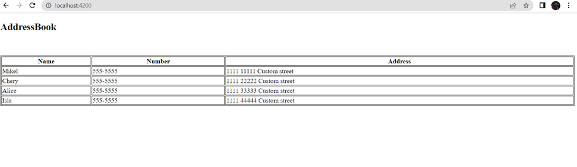
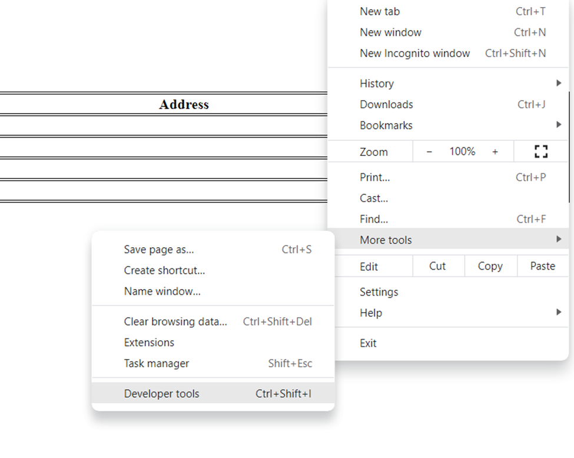
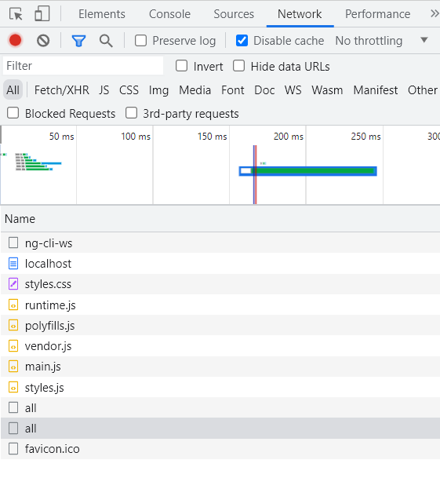
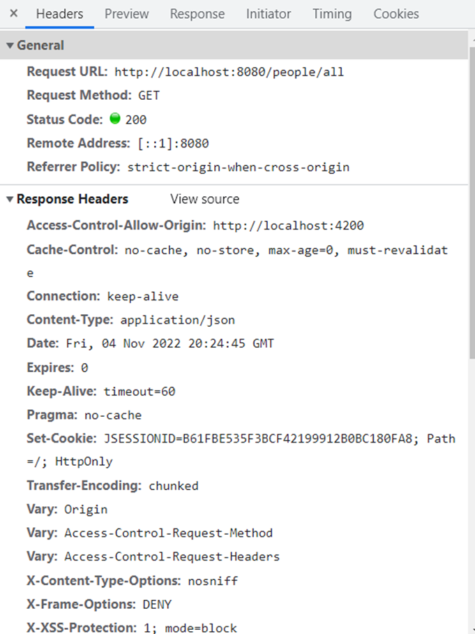
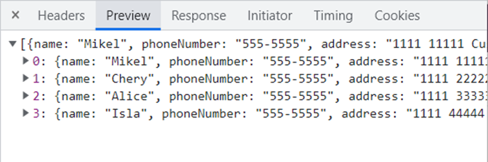

# Address Book

You have been hired to develop online address book. Below are the feature requirements

* The address book will display the name, phone number and address for each person in the H2 database. You will need to create a SpringBoot application to support the backend and an Angular frontend to display the information.

Now that you have completed exercises 1 through 6 it is time to run the application and see how everything works together. 

## Running the Backend

1. Load the application into InteliJ
2. Right click the POM file and select `add as maven project` from the menu selection
2. Right click on StoreApplication and select run or from the cmd line use `mvn spring-boot:run`
3. The application will be running on  `http://localhost:8080/`

## Monitoring and troubleshooting

To monitor the status of the application we can goto the console. After we run the application we should see the following line displayed at the end of the console

```
INFO 46820 --- [  restartedMain] o.s.b.w.embedded.tomcat.TomcatWebServer  : Tomcat started on port(s): 8080 (http) with context path ''
INFO 46820 --- [  restartedMain] udacity.com.PeopleApplication       : Started PeopleApplication in 5.455 seconds (JVM running for 13.34)
```
This tells us that the server is up and running awaiting requests on port 8080

-note: If you do not see a run menu item from intelij you may need to mark the java folder as a src folder to make it compiles.

* Open a browser and type in `http://localhost:8080/people/all` to ensure the API is working correctly

-Note: Your data might look different depending on what you populated the database with for testing.
```
[{"name":"Mikel","phoneNumber":"555-5555","address":"1111 11111 Custom street"},{"name":"Chery","phoneNumber":"555-5555","address":"1111 22222 Custom street"},{"name":"Alice","phoneNumber":"555-5555","address":"1111 33333 Custom street"},{"name":"Isla","phoneNumber":"555-5555","address":"1111 44444 Custom street"}]
```
If you are prompted for a username and password use `udacity` and `password`. This information is provided in the `application.properties`
## Running the frontend

1. Navigate to /angular
2. Install dependencies with `npm install`.
3. Run `ng serve ` for a dev server.
4. Navigate to `http://localhost:4200/`.

### Monitoring and Troubleshooting

* Open up a web browser and enter `http://localhost:4200/` to navigate to the application.

You should see the address book application up and running populated with your test data that you added to the server.

* To monitor the application and help you troubleshoot issues goto developer tools in your browser

* In the navigation page refresh the application in the browser to see the different requests the application is performing

* From here we can investigate the different network calls.
* Let's look at the two `all` requests. The first one is a preflight request which makes sure the request can be made. The second one will contain the header information and response data.


